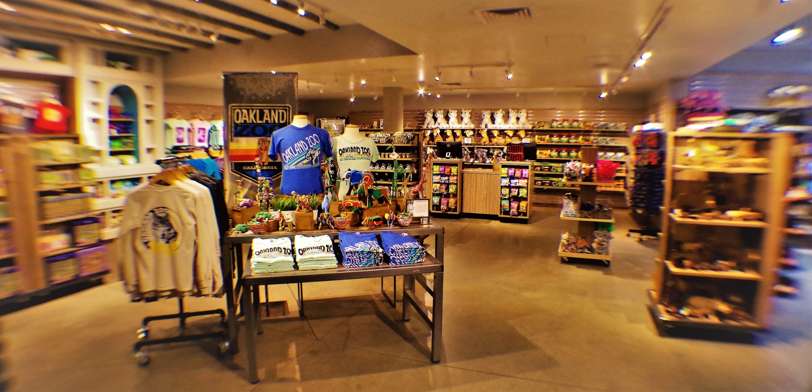

# Simple Shop


<a name="Overview"></a>
## Overview
Simple shop is a web application where you keep records or existing product in different categories. 
Also, it gives a lot of tools to perform CRUD operations on products and categories itself.

## Use cases
When you enter the application website you enter like a guest, and you have access only to these actions:
* Add new category
* Update, Get or Delete existing category by id
* Add new product
* Update, Get or Delete existing product by id
* Get all existing products in specific price limits
* Get all existing products in specific category 

<a name="Rest-end-points"></a>
## REST end points: 
```
POST: /categories
GET: /categories/{id}
PUT: /categories/{id}
DELETE: /categories/{id}
POST: /products
GET: /products/{id}
GET: /products/by-price
GET: /products/by-category
PUT: /products/{id}
DELETE: /products/{id}
```
You can see more details using swagger-UI. Try to call `http://localhost:8080/swagger-ui/index.html#/` after application startup

<a name="Used-Technologies"></a>
## Used Technologies
* Java version 11
* Spring boot
* Spring data JPA
* H2
* MySQL
* Maven
* Cucumber testing library
* FlyWay
* Swagger

<a name="Project-structure"></a>
## Project structure
Project implemented refers to an n-tier structure and has three layers:

1. Data access layer (DAO)
1. Application layer (service)
1. Presentation layer (controllers)

<a name="Application-startup"></a>
## Application startup
1. Load dependencies which are described in `pom.xml` using Maven
3. Launch the application by running `DataJpaAplication` class
4. Interact with end points using <a href="https://www.postman.com">Postman</a>

### Note:
1. You can start using MySql instead H2 inmemory database by just changing `resources/aplication.properties` file
2. You can insert some records on application start up by adding/changing FlyWay migrations in `resources/db.migrations`

